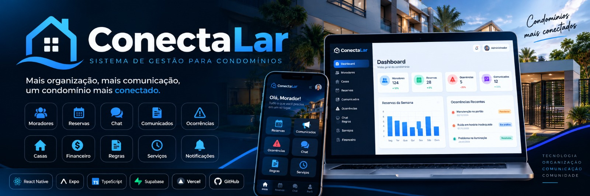

<p align="center">
  
</p>


# 🏢 ConectaLar

### Sistema de Gestão para Condomínios

**Mais organização, mais comunicação e um condomínio mais conectado.**

O **ConectaLar** é uma plataforma de gestão condominial desenvolvida para facilitar a administração, melhorar a comunicação entre moradores e síndicos e centralizar os serviços do condomínio em um único lugar.

🌐 **[Acessar o ConectaLar](https://conectalar-one.vercel.app/)**

---

## 🚀 Tecnologias utilizadas


## 💻 Funcionalidades

### 👨‍💼 Painel Administrativo

- Dashboard administrativo.
- Gerenciamento e cadastro de moradores.
- Controle de casas e unidades.
- Gerenciamento de reservas.
- Publicação de comunicados.
- Controle de ocorrências.
- Chat com moradores.
- Chat geral.
- Gerenciamento de regras do condomínio.
- Horários de serviços.
- Notificações.
- Gestão financeira.
- Cadastro de receitas e despesas.
- Envio de documentos financeiros.
- Controle de visibilidade de informações financeiras para moradores.

### 🏠 Área do Morador

- Login do morador.
- Dashboard personalizado.
- Reservas de churrasqueira e salão de festas.
- Visualização de comunicados.
- Registro de ocorrências.
- Chat com a administração.
- Chat geral do condomínio.
- Consulta às regras.
- Horários de serviços.
- Notificações.
- Perfil do morador.
- Consulta aos lançamentos financeiros disponibilizados pela administração.

## 🏗️ Arquitetura do sistema

O ConectaLar utiliza uma arquitetura integrada, com interfaces web e mobile conectadas ao Supabase.

```text
                 CONECTALAR
                     |
          +----------+----------+
          |                     |
      ÁREA WEB              APP MOBILE
          |                     |
          +----------+----------+
                     |
               REACT NATIVE
                  + EXPO
                     |
                  SUPABASE
                     |
          +----------+----------+
          |          |          |
       AUTH       DATABASE    STORAGE
          |          |          |
          +----------+----------+
                     |
                POSTGRESQL
```

### Organização do projeto

```text
conectalar/
├── assets/
├── src/
│   ├── components/
│   ├── navigation/
│   ├── screens/
│   │   ├── auth/
│   │   ├── admin/
│   │   ├── morador/
│   │   └── web/
│   │       ├── adm/
│   │       └── morador/
│   ├── services/
│   └── theme/
├── supabase/
│   └── functions/
├── App.tsx
├── package.json
└── README.md
```

## 💰 Gestão financeira

O módulo financeiro permite à administração acompanhar as receitas e despesas do condomínio.

**Principais recursos:**

- Registro de lançamentos.
- Categorização de receitas e despesas.
- Controle de vencimentos.
- Registro de pagamentos.
- Anexação de documentos.
- Visualização de informações autorizadas pelos moradores.

**Melhoria planejada:** implementação de OCR para leitura automática de documentos financeiros e preenchimento assistido dos campos.

## 📸 Capturas de tela

### Dashboard administrativo

*Imagem a ser adicionada.*

### Dashboard do morador

*Imagem a ser adicionada.*

### Módulo financeiro

*Imagem a ser adicionada.*

## ⚙️ Como executar o projeto

**1. Clone o repositório**

```bash
git clone https://github.com/Lukzinhoo/conectalar.git
```

**2. Entre na pasta**

```bash
cd conectalar
```

**3. Instale as dependências**

```bash
npm install
```

**4. Configure o Supabase**

Crie o arquivo `.env.local`:

```env
EXPO_PUBLIC_SUPABASE_URL=SUA_URL
EXPO_PUBLIC_SUPABASE_ANON_KEY=SUA_CHAVE_PUBLICA
```

É necessário configurar também o banco de dados, as políticas de acesso e os demais recursos utilizados pelo projeto.

**5. Execute o sistema**

Para a versão web:

```bash
npx expo start --web
```

Para executar com Expo Go:

```bash
npx expo start --go
```

## 🔐 Segurança

O sistema utiliza autenticação Supabase e foi projetado para separar o acesso de moradores e administradores.

As políticas de segurança do banco de dados e do armazenamento devem ser revisadas e validadas antes do uso com informações reais.

Nenhuma chave privada ou credencial administrativa deve ser publicada no repositório.

## 🗺️ Roadmap

- [x] Estrutura inicial do projeto.
- [x] Integração com Supabase.
- [x] Painel administrativo web.
- [x] Área web do morador.
- [x] Reservas e comunicados.
- [x] Chats e ocorrências.
- [x] Gestão financeira.
- [x] Consulta financeira para moradores.
- [ ] OCR para documentos financeiros.
- [ ] Testes automatizados.
- [ ] GitHub Actions.
- [ ] Revisão de segurança e permissões.
- [ ] Melhorias de acessibilidade e experiência mobile.

## 👨‍💻 Desenvolvedor

Desenvolvido por **[Lukzinhoo](https://github.com/Lukzinhoo)**.

🌐 **[Demonstração online](https://conectalar-one.vercel.app/)**

---

**🏢 ConectaLar — Tecnologia, organização e comunicação para condomínios.**

*Projeto em desenvolvimento contínuo.*
